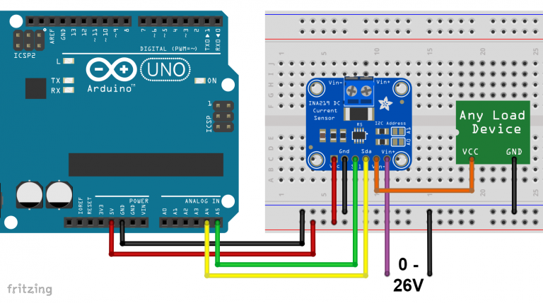
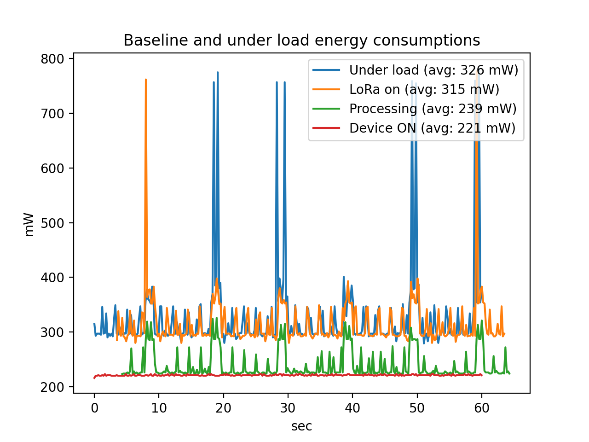

# Evaluation

## Contents
- [Power consumption](#energy-consumption)
- [Energy harvesting](#energy-harvesting)
- [Task timing](#task-timing)
- [Time sync](#time-sync)
- [Sampling parameters](#sampling-parameters)
- [LoRa parameters](#lora-parameters)

### Power consumption

#### Circuit

For the power consumption evaluation the following circuit is used.

The code used by the Arduino is at [src/measurement/src/measurement.ino](../src/measurement/src/measurement.ino)

#### Graph

The energy measurement are measured in the following conditions:
- Device ON: the device just executes the Main task that performs nothing, remaining on.
- Processing: the device only uses I2C to communicate with the accelerometer and performs fft, finding outliers
- LoRa ON: the whole code is executed. The device is kept still, so it only sends heartbeat packets through LoRa
- Under load: the device is moved, so data about outliers is sent through LoRa

In these graphs we can clearly see that there are significant spikes in energy consumption every 10 seconds.
This is the data_processing tasks that performs most of the computation and that is responsible of sending data
through LoRa. More details in the section [task timing](#task-timing)

### Energy harvesting

Based on the previous section, the average power consumption under load is 326 mW.

In order to ensure the system can operate on battery power for an entire day, we need to calculate the battery capacity:

$$ E_{bat} = P_{avg} \cdot t_{day} = 326.0 mW \cdot 24 h = 7824.0 mWh = 7.824 Wh $$

A battery recovered from a tablet, with a capacity of $11.1 Wh$ should be sufficient to meet the energy needs for more than a day (1 day, 10 hours).

Regarding the solar panel, it should provide for a day enough energy to power the node AND recharge the battery.
The battery may be almost empty and it needs to be recharged during the period of light to be ready for the next day.

So the calculation of the solar panel power, assuming 6 hours of light a day ($t_{light} = 6 h$) is:

$$ P_{solar} = \frac{E_{bat}}{t_{light}} + P_{avg} = \frac{7.824 Wh}{6 h} + 0.326 Wh = 1.63 W $$

A solar panel like [this one](https://www.amazon.it/dp/B09JFYPDNC) on Amazon, rated for 6W @ 5V is more than enough.

### Task timing

The time-critical parts of the node firmware are the data_collect and data_process tasks.

The data_collect task fills a array containing 10 seconds worth of samples (2048 samples, 200Hz sampling frequency).
Once finished, it wakes up the data_process task, which takes the filled array, processes the data and sends the results via LoRa.

The data_collect task does not wait the completion of data_process task, otherwise the samples could be lost, so it starts a new sampling window in another *slot* of the data array.

As there are two slots, the data_process task has to release the old slot before the data_collect starts collecting again there.

It is critical that an iteration of the data_process task takes less than an iteration of the data_collect task.

We measured the time taken by one iteration of data_process, for ensuring that such scenario doesn't happen. We performed this measurement using the `esp_timer_get_time()` function.

The calculation part of the task has a fixed duration, on average 48 ms.
For each event sent via LoRa, additional 75.5 ms are spent, which is roughly the airtime of the packet.

With a sampling window duration of 10 seconds, the maximum number of packets that can be sent without exceeding the time slot limit is:

$$n_{pkt} = \frac{10000 ms - 48 ms}{75.5 ms} = 131 $$

which is a lot more than we need, so there is no timing issue between tasks.

### Time sync

As our node network is distributed, a method to sync events is needed.

It can happen that a node has just finished doing FFT + z-score calculation but another node just started sampling.

How do we aggregate values belonging to unaligned windows?

When each node transmits an event packet, it attaches an *epoch* value.
This value is managed by the controller, which increments it and broadcasts via LoRa to all the nodes the new epoch each 20 seconds, which is double of the sampling window.

This ensures that the values are aggregated inside a window of 20 seconds, which is less than the minute of end-to-end latency requirement stated before.

### Sampling parameters

Our application requires sampling at least at $F_s = 200 Hz$ to capture the desired range of frequencies, which is 0-100 Hz.

The sampling window duration is calculated as follows:

$$T_{window} = \frac{n_{samples}}{F_s}$$

So, fixed the sampling frequency, the only variable parameter is the number of samples. $n_{samples}$ defines also the FFT output size, which is exactly half of it.

Having an FFT result array too big can lead to multiple outliers detected by  the data_process task, as they all relate to the same frequency.

For example, a vibration at 12.7 Hz can result in 4 different events: 12.71 Hz, 12.73 Hz, 12.75 Hz, 12.77 Hz.

To mitigate this issue, we implemented a basic clustering algorithm for neighboring outliers. It simply finds contiguous elements of the FFT output array which are outliers and sends only one packet for the median frequency.

Conversely, a low $n_{samples}$ leads to a $T_{window}$ too small, so an event which continues for multiple sampling windows results in more packets sent for the same frequency.

### Accuracy of data

We have performed a rough test on the accuracy of the data sent by the device, placing it on top of a
speaker and playing sound waves, ranging from 35Hz to 100Hz.

The accuracy of the data send, even considering the aggregation, seems to have roughly an error of $\pm 0,1 Hz$.
However, from 90 Hz upwards the accuracy decreases.

### LoRa parameters

For our purpose, the LoRa communication should be optimized to prefer reliability and range over bandwidth.

LoRa has three main parameters: spreading factor, bandwidth and coding rate.
Tuning all of them is a matter of tradeoffs (eg. airtime vs link budget) and we used [this guide](https://medium.com/home-wireless/testing-lora-radios-with-the-limesdr-mini-part-2-37fa481217ff) to get an idea.

Basically:
- Each unit increase in spreading factor doubles the time on air to transmit a symbol
- Each unit increase in spreading factor increases link budget by almost 2.5dB
- Each doubling of the bandwidth decreases link budget by almost 3dB
- Increasing the coding rate increases reliability while decreasing data rate

We used [LoRaTools air time calculator](https://www.loratools.nl/#/airtime) to estimate time on air given.

After some experiments, we set the parameters to meet distance requirement while minimizing air time:

- Spreading factor: 7
- Bandwidth: 125 kHz
- Coding rate: 1
