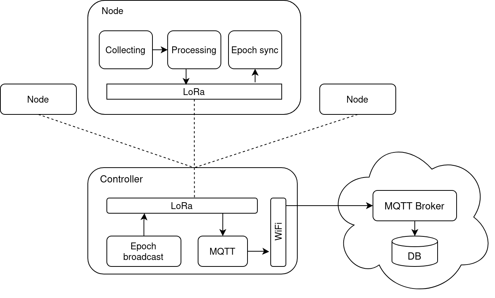

# Technology

## High level diagram



## Components

- [Nodes](#nodes), attached to critical points of the infrastructure to monitor
- [Controller](#controller), an edge device to aggregate data received from nodes, one for each infrastructure (eg. bridge)
- [Cloud system](#cloud-system), to store events received from the controllers and send alerts

### Nodes

Each node is composed of:

- Heltec LoRa V3 board
- [Accelerometer](#accelerometer)
- [LoRa module](#lora-module)
- [Battery](#battery)
- Solar panel

Each node samples the three axes of an accelerometer at a rate of 200 Hz, sufficient to capture vibrations at a maximum of 100 Hz (Nyquist frequency).
After collecting a window of samples (eg. 20s), some calculations are done for each axis:

- FFT to extract frequency components
- Z-score to find outliers
- Clustering for neighboring values

Then, resulting values are sent to the [controller](#controller) via LoRa radio.

The nodes are power-constrained as they have to be autonomous from the point of view of energy harvesting, so a solar panel is needed.
Also, a battery is necessary to provide power also in periods of darkness.

#### Accelerometer

The accelerometer is the Analog Devices ADXL345. It is connected to the Heltec board using the I2C bus:

| ADXL345 | Heltec                 |
| :------ | :--------------------- |
| VCC     | 3.3V                   |
| GND     | GND                    |
| SDA     | GPIO 47 (pin 13 right) |
| SCL     | GPIO 48 (pin 14 right) |
| CS      | 3.3V                   |
| SDO     | GND                    |

CS to 3.3V is needed to put the accelerometer in I2C mode, as it can use either I2C or SPI.

SDO to GND is needed to signal the accelerometer to use the main I2C address (0xE5).

#### Battery

Our battery is a standard 3.7V Li-Po battery, like the ones that are found in smartphones/tablets.

The Heltec board provides also a voltage regulator and a BMS (battery management system) with a dedicated 2-pin connector for a Li-Ion/Li-Po battery.

This allows the board to operate in the absence of an external power source until the battery runs out.
When the power source is restored, the BMS transparently begins recharging the battery until it is fully charged, and then stops drawing current.

This setup is ideal for our scenario, where a solar panel is used to power the node, but in the absence of sun, the battery should continue to provide power.

Connections:

- The battery is connected to the specific connector on the Heltec board
- The solar panel output (+/-) is connected to 5V/GND of the Heltec board

Specifically, each node has to function for an entire day without providing external power and the battery has to be fully charged in 6 hours of light.

A battery evaluation is described in the [energy harvesting](./evaluation.md#energy-harvesting) section of the evaluation document.

### Controller

Each controller is composed of:

- Heltec LoRa V3 board
- [LoRa module](#lora-module)
- Wi-Fi module

The controller essentially has two functions:

- Listens the LoRa channel for incoming messages from nodes and relays them to the cloud server via MQTT
- Sends a periodic time sync signal to all nodes, explained in the [time sync](./evaluation.md#time-sync) section of the evaluation document

Optionally, a data aggregation logic can be implemented on the controller, to generate higher level events to be sent to the cloud.

#### LoRa module

LoRa module is the Semtech SX1262. It is provided by the Heltec board and is internally connected to SPI2 bus.
The connections to use are the following:

| SX1262  | ESP32   |
| :------ | :------ |
| MISO    | GPIO 11 |
| MOSI    | GPIO 10 |
| SCLK    | GPIO  9 |
| NSS     | GPIO  8 |
| RST     | GPIO 12 |
| BUSY    | GPIO 13 |

LoRa parameters (spreading factor, bandwidth, coding rate) are adjusted to meet range requirements (at least 100m). This is explained in detail in the section [LoRa parameters](./evaluation.md#lora-parameters) section of the evaluation document.

### Cloud system

The cloud system employs three components:

- [MQTT broker](#mqtt-broker)
- Database
- [Listener service](#listener-service)

The software stack is deployed using `docker compose`, to speed up the initial setup.
In a final setup, the cloud system is managed by the manufacturer of the devices (so by us), while the nodes and the controller are managed by the company responsible for the infrastructure.

To initialize and bring up the entire cloud system:
```sh
cd src/cloud
docker compose up -d
```

#### MQTT broker

Our MQTT broker is Eclipse Mosquitto.

The communication with the MQTT broker is secured with MQTTS, utilizing the TLS protocol for protection. Each controller is equipped with the CA certificate, to establish the identity of the server.

#### Listener service

The listener service is written in Python using Paho MQTT library.

Its job is minimal: receives events from MQTT and stores them in the database, for a later analysis.
